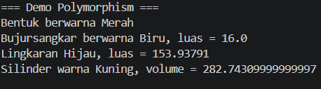
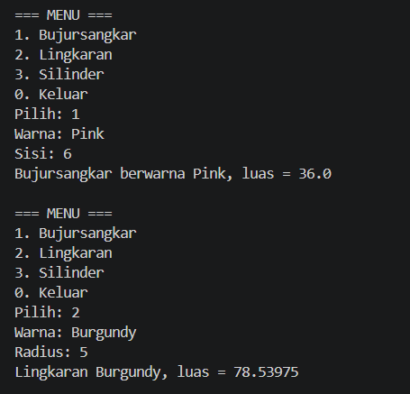
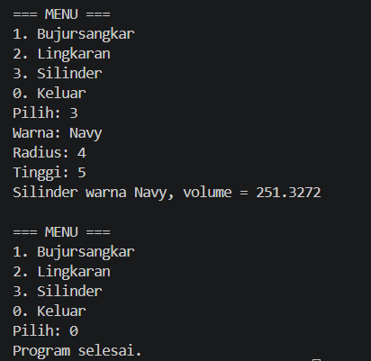

# Latihan 5C - Inheritance dan Polymorphism (Java)

**NIM:** (isi NIM)
**Nama:** Rendy

Program ini mengimplementasikan hierarki kelas `Bentuk` → `BujurSangkar`, `Bentuk` → `Lingkaran` → `Silinder`.

## Struktur File
- `Bentuk.java` – kelas induk (atribut `warna`)
- `BujurSangkar.java` – turunan Bentuk (atribut `sisi`, hitung luas)
- `Lingkaran.java` – turunan Bentuk (atribut `radius`, konstanta `PHI`, hitung luas)
- `Silinder.java` – turunan Lingkaran (atribut `tinggi`, hitung volume)
- `Main.java` – demo objek, polymorphism, dan menu sederhana (Scanner)

## Penerapan Konsep OOP

### 1. Encapsulation
Semua atribut (`warna`, `sisi`, `radius`, `tinggi`) dideklarasikan `private`, sehingga tidak bisa diakses langsung dari luar kelas. Akses dan perubahan nilai dilakukan lewat method `getter` dan `setter` (mis. `getWarna()`, `setRadius()`). Contoh: `Silinder` mengambil warna lewat `getWarna()`, bukan langsung ke variabel `warna`.

### 2. Inheritance
- `BujurSangkar` dan `Lingkaran` memakai `extends Bentuk`, sehingga mewarisi atribut `warna` beserta getter/setter-nya.
- `Silinder` memakai `extends Lingkaran` (pewarisan bertingkat), sehingga mewarisi `radius`, `PHI`, dan `hitungLuas()` yang dipakai untuk menghitung volume (`luas alas × tinggi`).
- Constructor kelas turunan memanggil constructor induk dengan `super(...)`.

### 3. Polymorphism
- **Overriding:** `printInfo()` di-override pada `BujurSangkar`, `Lingkaran`, dan `Silinder` dengan `@Override`, sehingga tiap kelas mencetak format berbeda.
- **Upcasting / dynamic binding:** di `Main`, array bertipe `Bentuk[]` diisi objek `Bentuk`, `BujurSangkar`, `Lingkaran`, dan `Silinder`. Saat `b.printInfo()` dipanggil, Java menjalankan versi method sesuai tipe objek sebenarnya.

## Screenshot
### Output Main

